

# SuperAGI - Google Calendar Toolkit

Introducing the Google Calendar Toolkit, a powerful integration for SuperAGI. With the Gogole Calendar toolkit, you gain the ability to do the following:

1. **Create Calendar Events**
2. **List your Calendar Events**
3. **Fetch an event from your Calendar**
4. **Delete Calendar Events**

# ⚙️ Installation

### ⚒️ Setting up of SuperAGI

Set-up SuperAGI by following the instructions given [here](https://github.com/TransformerOptimus/SuperAGI/blob/main/README.MD)

# ✅ Quick start Guide:

In order to get started with integrating Google Calendar with SuperAGI, you need to do the following:

## API Creation and OAuth Consent Screen

1. Go to Google Developer Console:
[https://console.cloud.google.com/](https://console.cloud.google.com/) & Create a new project. If you’re having an existing project, you can proceed with that as well:

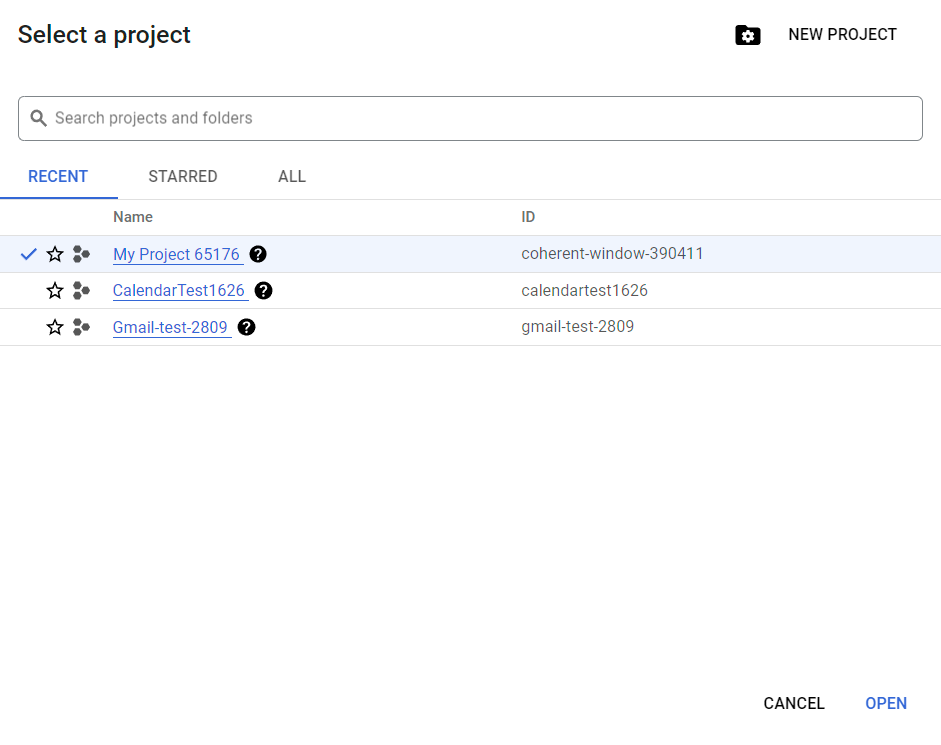

2. After the project is created/you’re in your selected project, head to “APIs and Services”

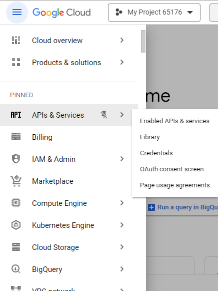

3. Click on “ENABLED APIS AND SERVICES” and search for “Google Calendar”

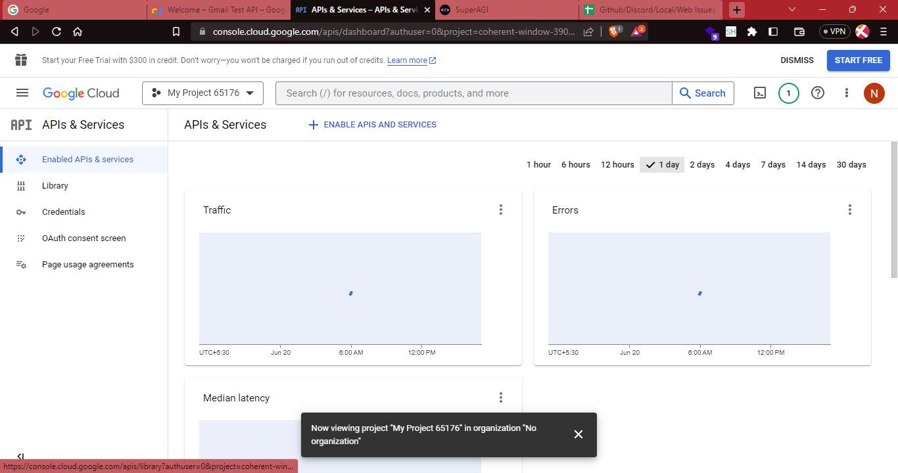

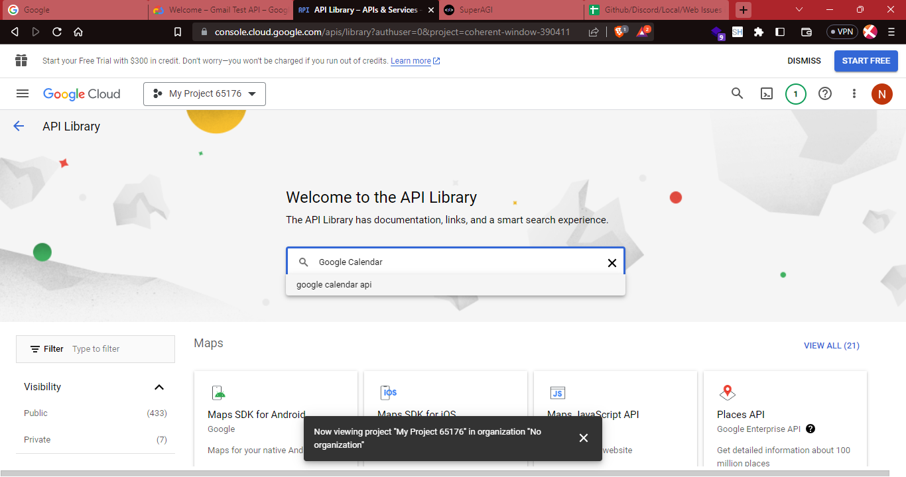

4. Enable the API

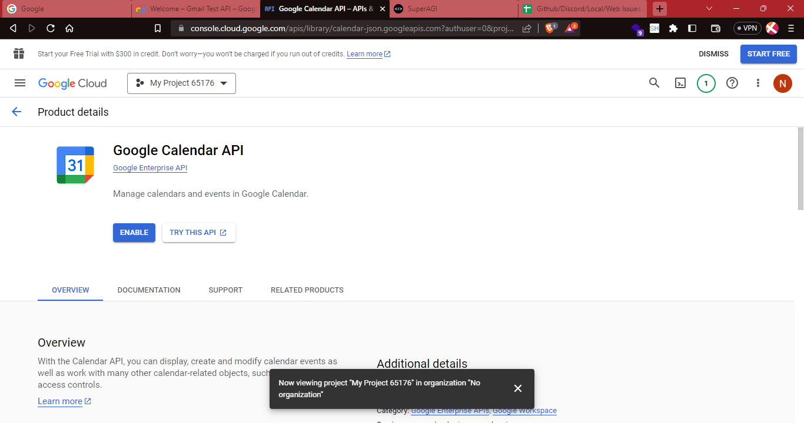

5. Once the API is Enabled, go to “OAuth Consent Screen” 

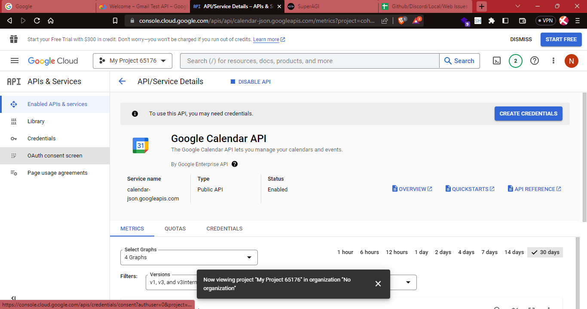

6. Select your User Type as “External” and click on "Create"

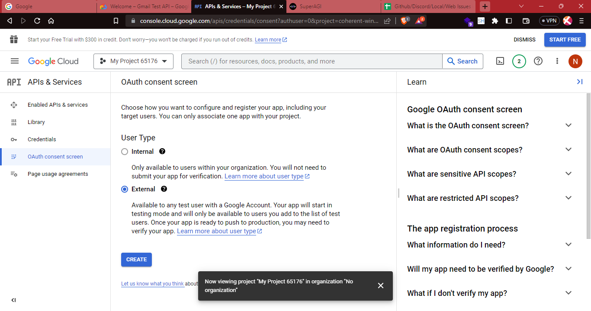

7. Fill in the required details such as the App Information, App Domain, Authorized Domain, Developer contact information. Once filled in, click “Save and Continue” 

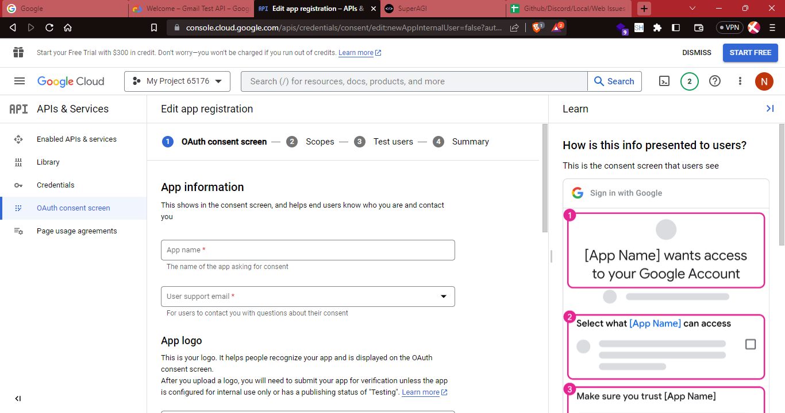

8. On the next page, you don’t need to select scopes. Proceed to “save and continue” and at the final page, review the process and click “Back to Dashboard”.  With this, you’ve created your OAuth Consent Screen for Google Calendar.
   
9. You can go ahead and click the “Publish App” 

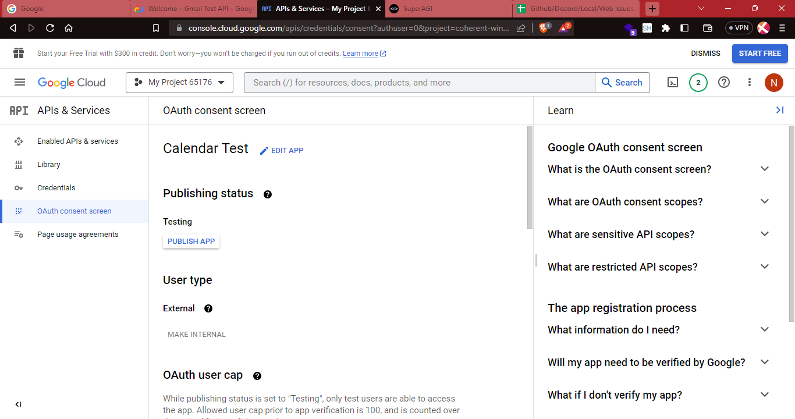

## 🔧 Configuring endpoints & obtaining Client ID and Client Secret Key

In order to obtain the Client ID and Secret ID, you need to do the following steps: 

1. Go to “Credentials” Page

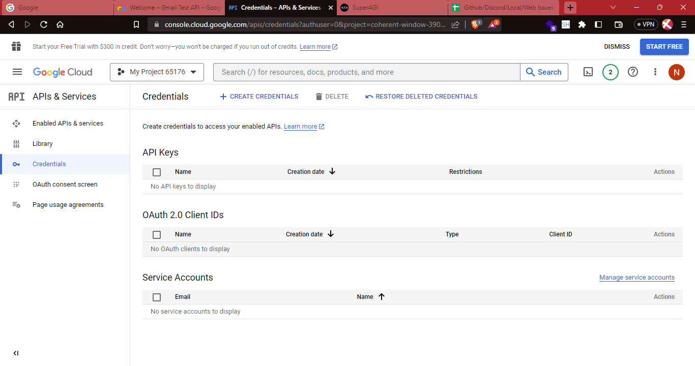

2. Click on “Create Credentials” and click on “OAuth Client ID”

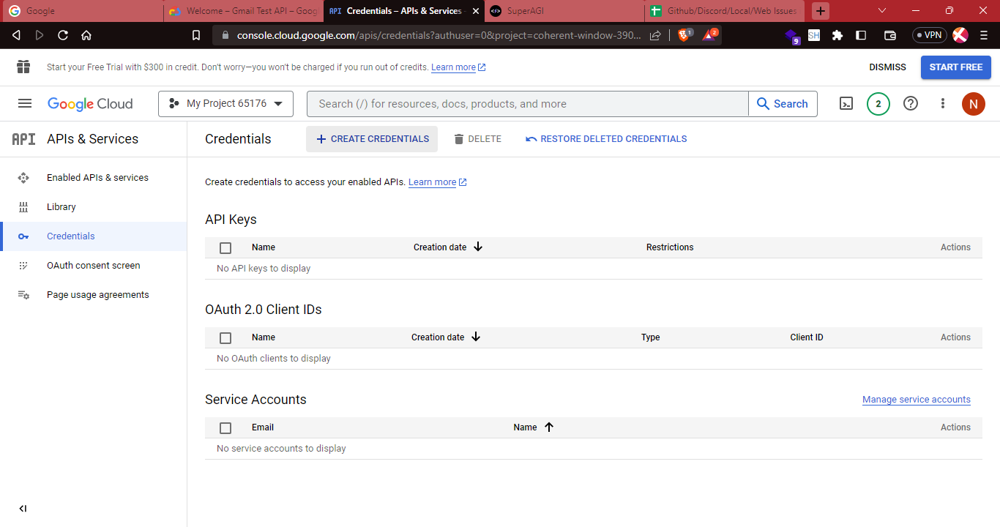

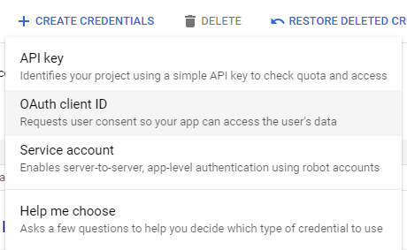

3. Once you click on OAuth Client ID, choose the type of application as “Web Application” and give it a name of your choice

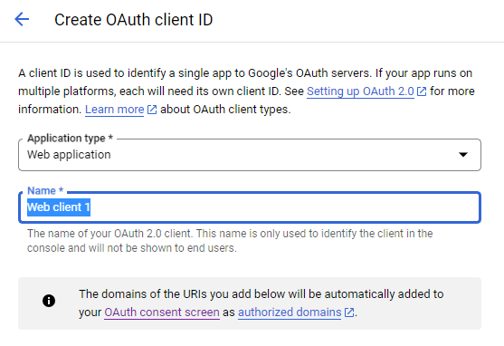

4. Create JavaScript Origins and add the following details as shown in the image: 

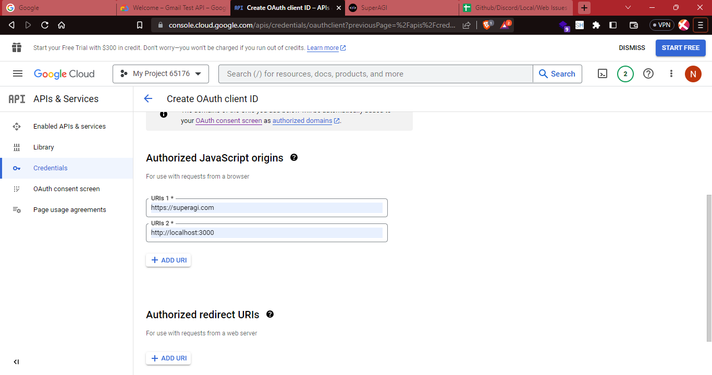

5. Go to Authorized redirect URIs and add the following as per the image: 

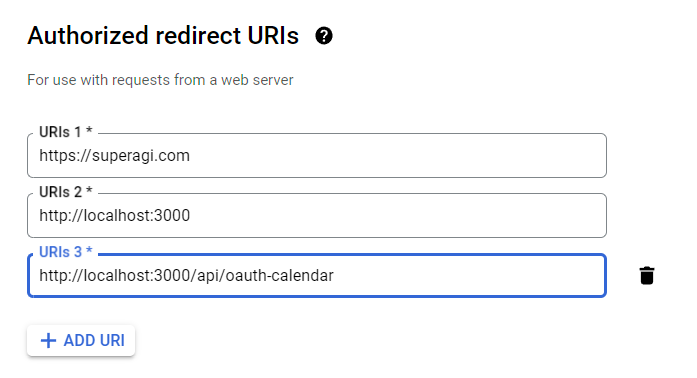

6. Once you’re completed with adding the Authorized redirect URIs, you can click “Create” to obtain the Client ID and Client Secret Key

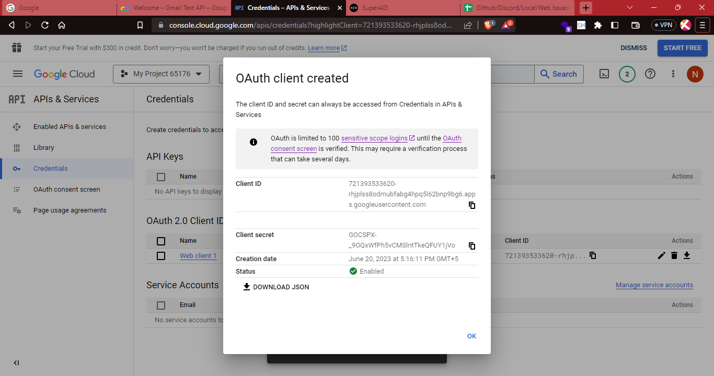

7. Copy the Client ID and Secret Key and save it in a file. 

## Configuring your Client ID, Secret Key and Authenticating Calendar with SuperAGI

Once the ClientID and Secret Key is obtained, you can configure and authorize Calendar to be used with SuperAGI by following these steps: 

1. Add your Client ID and Client Secret Key on the toolkit page and click on “Update Changes”

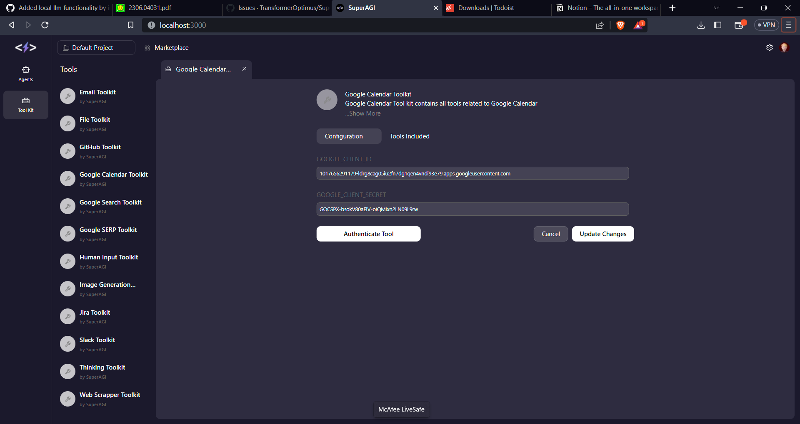

2. Click on “Authenticate Tool” - which will now take you to the OAuth Flow. 

Once the OAuth Authentication is complete, you can now start using SuperAGI Agents with Google Calendar!
