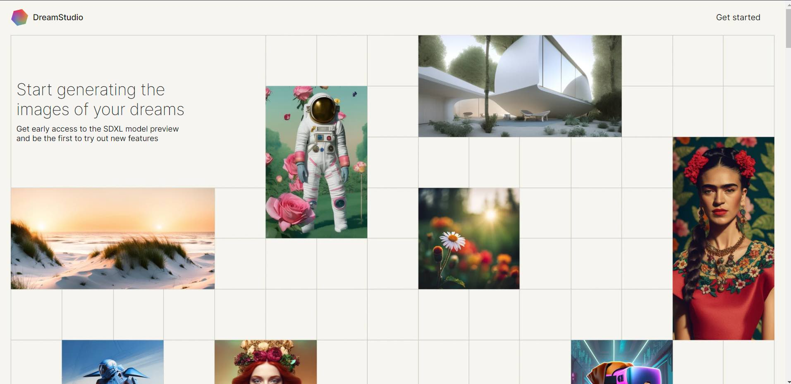
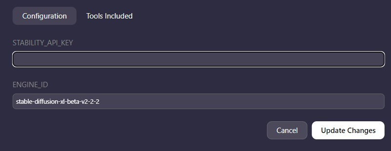
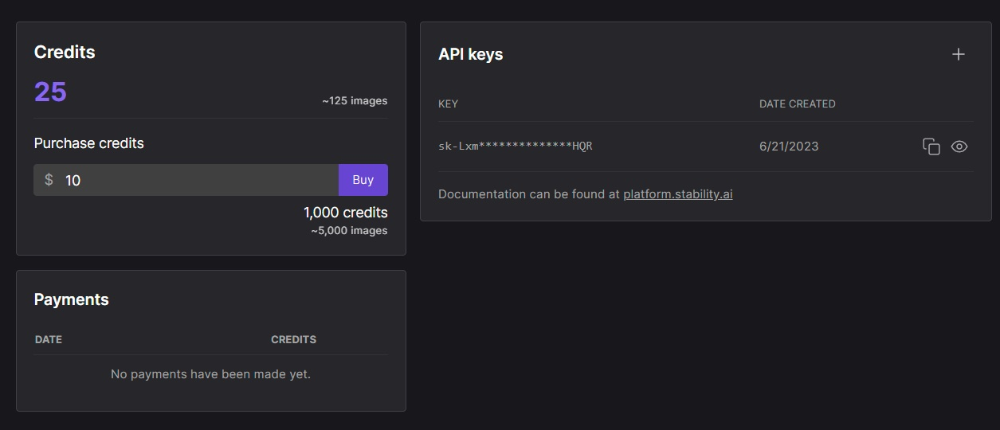
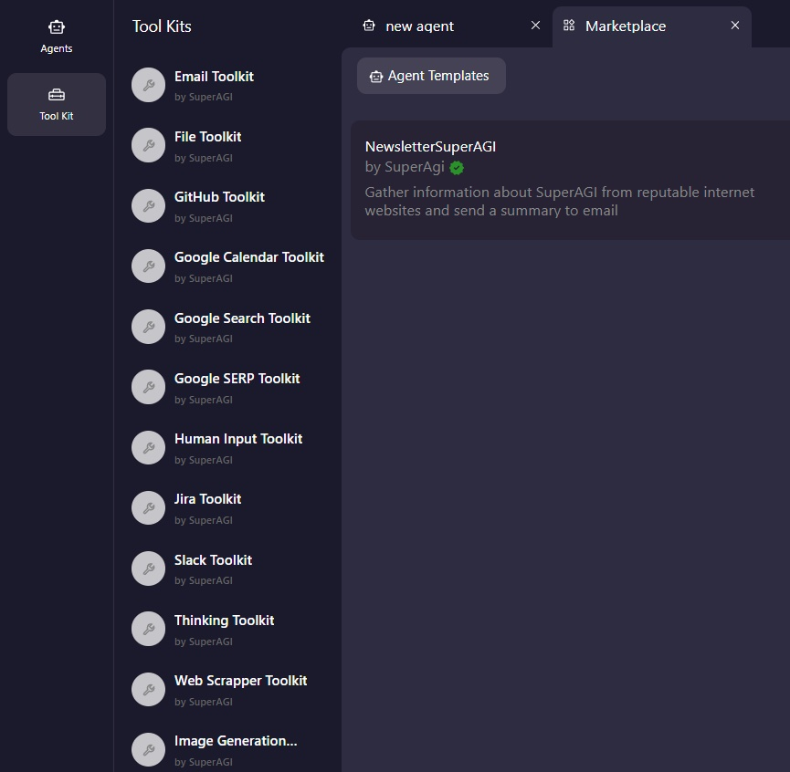

## SuperAGI Stable Diffusion Toolkit

Introducing Stable Diffusion Integration with SuperAGI

You can now use SuperAGI to summon Stable Diffusion to create true-to-life images and opens up a whole new range of possibilities. 

# ⚙️ Installation

## 🛠️ Setting up SuperAGI

Set-up SuperAGI by following the instruction given [here](https://github.com/TransformerOptimus/SuperAGI/blob/main/README.MD)

## 🔧Configuring API from DreamStudio

You can now get your API Key from Dream Studio to use Stable Diffusion by following the instructions below: 

1. Create an Account/Login with [DreamStudio.ai](http://DreamStudio.ai)

1. Click on the Profile Icon at the top right which will take you to the settings page. Once you have reached the settings page, you can now get your API keys 

1. Copy the API Key and save it in a separate file. 

## 🛠️Configuring Stable Diffusion with SuperAGI

You can configure SuperAGI with Stable Diffusion using the following steps:

1. Navigate to the “****************Toolkit”**************** Page in SuperAGI’s Dashboard and select “****************Image Generation Toolkit”**************** 

1. Once you’ve clicked Image Generation Toolkit, it will open a page asking you for the API Key and the Model Engine. You can enter the generated API key from Dream Studio here. 

3. If you would like to get more in-depth with the model of Stable Diffusion you’d like to use, you can choose between the following engine IDs: 

- 'stable-diffusion-v1'
- 'stable-diffusion-v1-5'
- 'stable-diffusion-512-v2-0'
- 'stable-diffusion-768-v2-0'
- 'stable-diffusion-512-v2-1'
- ’stable-diffusion-768-v2-1'
- 'stable-diffusion-xl-beta-v2-2-2’

You have now successfully configured Stable Diffusion with SuperAGI!