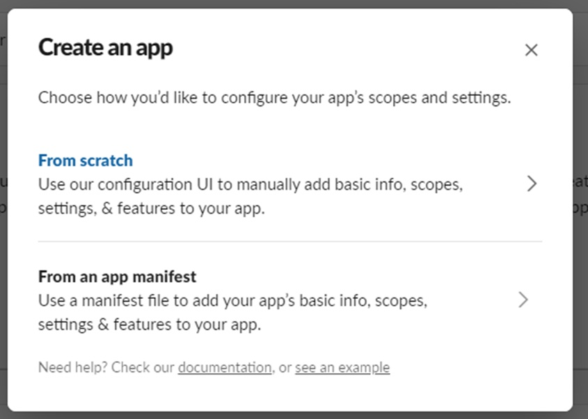
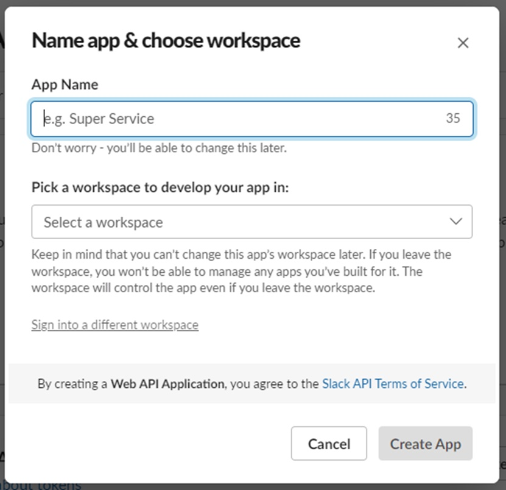
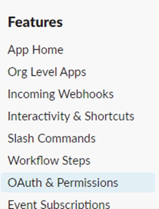
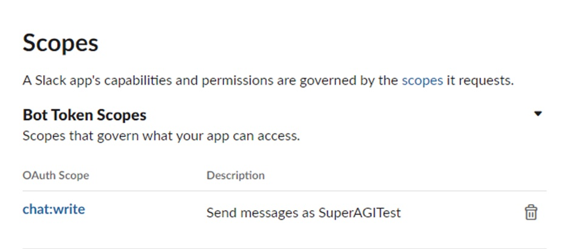
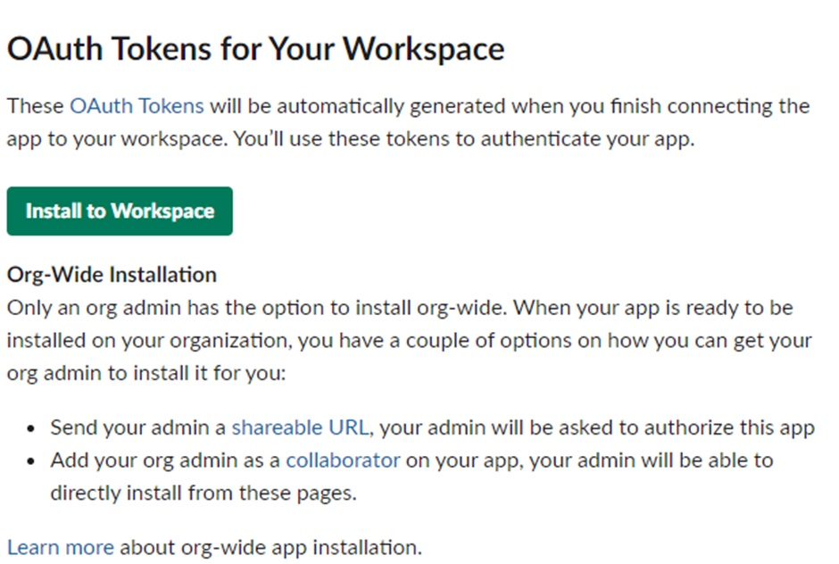
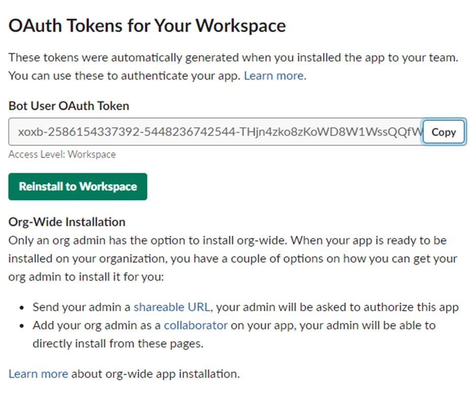
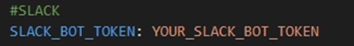

# SuperAGI Slack Toolkit

This SuperAGI Tool lets users send messages to Slack Channels and provides a strong foundation for use cases to come.

**Features:**

1. Send Message - This tool gives SuperAGI the ability to send messages to Slack Channels that you have specified.

## 🛠️ Installation

Setting up of SuperAGI:

Set up the SuperAGI by following the instructions given (https://github.com/TransformerOptimus/SuperAGI/blob/main/README.MD)

### 🔧 **Slack Configuration:**

1. Create an Application on SlackAPI Portal
    
    
    
2. Select "from scratch"
    
    
    
3. Add your application's name and the workspace for which you'd like to use your Slack Application on
    
    
    
4. Once the app creation process is done, head to the "OAuth and Permissions" tab
    
    
    
5. Find the “**bot token scopes”** and define the following scopes:
    
    **"chat:write",**  and save it
    
    
    
6. Once you've defined the scope, install the application to your workspace.

    
    
    
7. Post installation, you will get the bot token code

    
    
    
8. Once the installation is done, you'll get the Bot User OAuth Token, which needs to be added in the config.yaml beside the **"slack_bot_token"** variable. 

Once the configuration is complete, you can install the app in the channel of your choice and create an agent on SuperAGI which can now send messages to the Slack Channel!